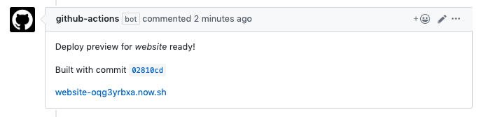

# Vercel Action


 
 


[](https://sonarcloud.io/dashboard?id=amondnet_vercel-action)
[](https://sonarcloud.io/dashboard?id=amondnet_vercel-action)
[](https://sonarcloud.io/dashboard?id=amondnet_vercel-action)
[](https://sonarcloud.io/dashboard?id=amondnet_vercel-action)
[](https://sonarcloud.io/dashboard?id=amondnet_vercel-action)
[](https://sonarcloud.io/dashboard?id=amondnet_vercel-action)

This action was formerly [Zeit Now Deployment](https://github.com/marketplace/actions/zeit-now-deployment). [Migration Guide](#migration-from-v2)
  

## Introduction to Vercel
​Vercel is a cloud platform for **static sites** and **Serverless Functions** that fits perfectly with your workflow. It enables developers to host **Jamstack** websites and web services that **deploy instantly**, **scale automatically**, and requires **no supervision**, all with **no configuration**.

This action make a Vercel deployment with github actions. 

- [x] Deploy to Vercel.
- [x] Comment on pull request.
- [x] Comment on commit.
- [x] [Password Protect ( Basic Auth )](https://github.com/amondnet/vercel-action#basic-auth-example)
- [x] [Alias domain to deployment.](https://github.com/amondnet/vercel-action#alias-domains)
- [ ] Create Deployment on github.

## Result



[pull request example](https://github.com/amondnet/now-deployment/pull/2)

[commit](https://github.com/amondnet/now-deployment/commit/3d926623510294463c589327f5420663b1b0b35f)
## Inputs

| Name              | Required                      | Default | Description                                                                                       |
|-------------------|:-----------------------------:|---------|---------------------------------------------------------------------------------------------------|
| vercel-token      |    <ul><li>- [x] </li></ol>   |         | Vercel token. see https://vercel.com/account/tokens                                                                                   |
| github-comment    |    <ul><li>- [ ] </li></ol>   |  true   | Its type can be either **string or boolean**. When string, it leaves PR a comment with the string. When boolean, it leaves PR a default comment(true) or does not leave a comment at all(false).                                                      |
| github-token      |    <ul><li>- [ ] </li></ol>   |         | if you want to comment on pull request or commit. `${{ secrets.GITHUB_TOKEN }}` ([GitHub token docs](https://docs.github.com/en/actions/configuring-and-managing-workflows/authenticating-with-the-github_token))                                                         |
| vercel-project-id |    <ul><li>- [x] </li></ol>   |         | ❗Vercel CLI 17+,The `name` property in vercel.json is deprecated (https://zeit.ink/5F)                  |
| vercel-org-id     |    <ul><li>- [x] </li></ol>   |         | ❗Vercel CLI 17+,The `name` property in vercel.json is deprecated (https://zeit.ink/5F)                  |
| vercel-args       |    <ul><li>- [ ] </li></ol>   |         | This is optional args for `vercel` cli. Example: `--prod`                                            |
| working-directory |    <ul><li>- [ ] </li></ol>   |         | the working directory                                                                             |
| scope             |    <ul><li>- [ ] </li></ol>   |         | If you are working in a team scope, you should set this value to your `team ID`.           
| alias-domains     |    <ul><li>- [ ] </li></ol>   |         | You can assign a domain to this deployment. Please note that this domain must have been configured in the project. You can use pull request number via `{{PR_NUMBER}}` and branch via `{{BRANCH}}`.         
| vercel-project-name |  <ul><li>- [ ] </li></ol>   |         | The name of the project; if absent we'll use the `vercel inspect` command to determine. [#27](https://github.com/amondnet/vercel-action/issues/27) & [#28](https://github.com/amondnet/vercel-action/issues/28)
## Outputs

### `preview-url`

The url of deployment preview.

### `preview-name`

The name of deployment name.

## How To Use

### Disable Vercel for GitHub

> The Vercel for GitHub integration automatically deploys your GitHub projects with Vercel, providing Preview Deployment URLs, and automatic Custom Domain updates.
[link](https://vercel.com/docs/v2/git-integrations)

We would like to to use `github actions` for build and deploy instead of `Vercel`. 

Set `github.enabled: false` in `vercel.json`, see example `vercel.json` file below:

```json
{
  "version": 2,
  "public": false,
  "github": {
    "enabled": false
  }
}

```
When `github.enabled` set to `false`, `Vercel for GitHub` will not deploy the given project regardless of the GitHub app being installed.

### Skip vercel's build step

Since we do the `build` in `github actions`, we don't need to build in `vercel`.

#### Method 1 - via vercel interface

- Specify "Other" as the framework preset, and
- Enable the Override option for the Build Command, and
- Leave the Build Command **empty**.
- This will prevent the build from being attempted and serve your content as-is.

See [docs](https://vercel.com/docs/concepts/deployments/build-step#build-command) for more details

#### Method 2 - via `vercel.json`

If a Deployment defines the builds configuration property, the vercel's `Build & Development Settings` are ignored.

```json
{
  "builds": [
    { "src": "{{Source for distribution}}", "use": "@vercel/static" }
  ]
}
```
Set `builds` to `@vercel/static` to skip vercel's build step. `src` is the path to the directory containing the files to be deployed.

See [docs](https://vercel.com/docs/cli#legacy/builds) for more details


### Project Linking

You should link a project via [Vercel CLI](https://vercel.com/download) in locally.

When running `vercel` in a directory for the first time, [Vercel CLI](https://vercel.com/download) needs to know which scope and Project you want to deploy your directory to. You can choose to either link an existing project or to create a new one.

> NOTE: Project linking requires at least version 17 of [Vercel CLI](https://vercel.com/download). If you have an earlier version, please [update](https://vercel.com/guides/updating-vercel-cli) to the latest version.

```bash
vercel
```

```bash
? Set up and deploy “~/web/my-lovely-project”? [Y/n] y
? Which scope do you want to deploy to? My Awesome Team
? Link to existing project? [y/N] y
? What’s the name of your existing project? my-lovely-project
🔗 Linked to awesome-team/my-lovely-project (created .vercel and added it to .gitignore)
```

Once set up, a new `.vercel` directory will be added to your directory. The `.vercel` directory contains both the organization(`vercel-org-id`) and project(`vercel-project-id`) id of your project.

```json
{"orgId":"example_org_id","projectId":"example_project_id"}
```

You can save both values in the secrets setting in your repository. Read the [Official documentation](https://help.github.com/en/actions/configuring-and-managing-workflows/creating-and-storing-encrypted-secrets) if you want further info on how secrets work on Github.

### Github Actions

* This is a complete `.github/workflows/deploy.yml` example.

Set the `vercel-project-id` and `vercel-org-id` you found above.

```yaml
name: deploy website
on: [pull_request]
jobs:
  deploy:
    runs-on: ubuntu-latest
    steps:
      - uses: actions/checkout@v2
      #  your build commands
      # - run: |
      #    ng build --prod
      - uses: amondnet/vercel-action@v20 #deploy
        with:
          vercel-token: ${{ secrets.VERCEL_TOKEN }} # Required
          github-token: ${{ secrets.GITHUB_TOKEN }} #Optional 
          vercel-args: '--prod' #Optional
          vercel-org-id: ${{ secrets.ORG_ID}}  #Required
          vercel-project-id: ${{ secrets.PROJECT_ID}} #Required 
          working-directory: ./sub-directory
```


### Angular Example

See [.github/workflows/example-angular.yml](/.github/workflows/example-angular.yml) , 


### Basic Auth Example

How to add Basic Authentication to a Vercel deployment

See [.github/workflows/example-express-basic-auth.yml](.github/workflows/example-express-basic-auth.yml)

[source code](https://github.com/amondnet/vercel-action/tree/master/example/express-basic-auth)

| `@now/node-server` is deprecated and stopped working. Use `@vercel/node` instead. #61

### Alias Domains

You can assign a domain to this deployment. Please note that this domain must have been [configured](https://vercel.com/docs/v2/custom-domains#adding-a-domain) in the project.

If you want to assign domain to branch or pr, you should add [Wildcard Domain](https://vercel.com/docs/v2/custom-domains#wildcard-domains).

You can use pull request number via `{{PR_NUMBER}}` and branch via `{{BRANCH}}`

#### Example 

Wildcard Domains : *.angular.vercel-action.amond.dev

*Per Pull Request*

https://pr-{{PR_NUMBER}}.angular.vercel-action.amond.dev

- PR-1 -> https://pr-1.angular.vercel-action.amond.dev
- PR-2 -> https://pr-2.angular.vercel-action.amond.dev

*Per Branch*

https://{{BRANCH}}.angular.vercel-action.amond.dev

- develop -> https://develop.angular.vercel-action.amond.dev
- master -> https://master.angular.vercel-action.amond.dev
- master -> https://master.angular.vercel-action.amond.dev


See [.github/workflows/example-angular.yml](/.github/workflows/example-angular.yml) 

```yaml
name: deploy website
on: [pull_request]
jobs:
  deploy:
    runs-on: ubuntu-latest
    steps:
      - uses: actions/checkout@v2
      - uses: amondnet/vercel-action@v19
        with:
          vercel-token: ${{ secrets.VERCEL_TOKEN }} # Required
          github-token: ${{ secrets.GITHUB_TOKEN }} #Optional 
          vercel-args: '--prod' #Optional
          vercel-org-id: ${{ secrets.ORG_ID}}  #Required
          vercel-project-id: ${{ secrets.PROJECT_ID}} #Required 
          working-directory: ./sub-directory #Your Working Directory, Optional
          alias-domains: | #Optional
            staging.angular.vercel-action.amond.dev
            pr-{{PR_NUMBER}}.angular.vercel-action.amond.dev
```


## Migration from v2

1. Change action name in `workflows` from `now-deployment` to `vercel-action`
   ```yaml
    - name: Vercel Action
      uses: amondnet/vercel-action@v19
   ```
2. Change input values.
    - `zeit-token` -> `vercel-token`
    - `now-org-id` -> `vercel-org-id`
    - `now-project-id` -> `vercel-project-id`

